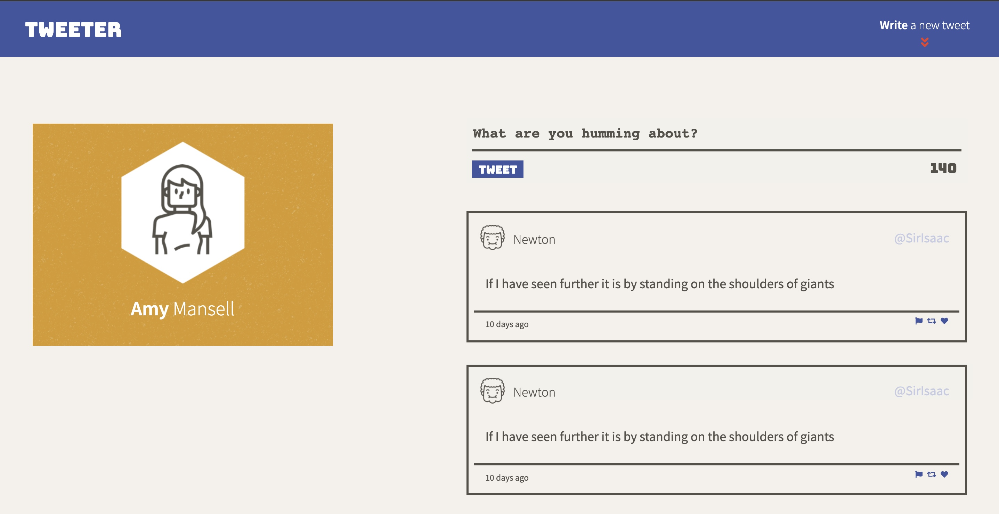

# Tweeter React SPA built Create React App

A Single Page App (SPA) Tweeter built with HTML, CSS, JS, jQuery and AJAX and Tweeter React.

## Available Scripts

In the project directory, you can run:

### `yarn start`

Runs the app in the development mode.\
Open [http://localhost:3000](http://localhost:3000) to view it in the browser.

The page will reload if you make edits.\
You will also see any lint errors in the console.
